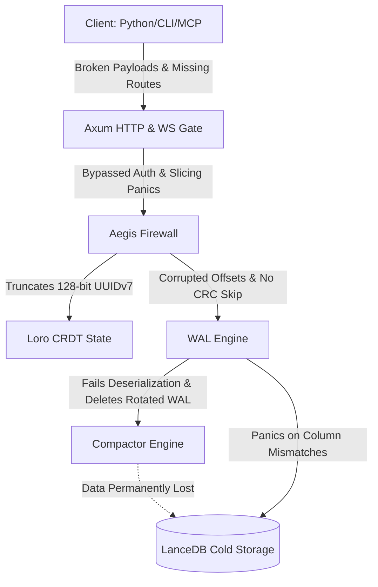
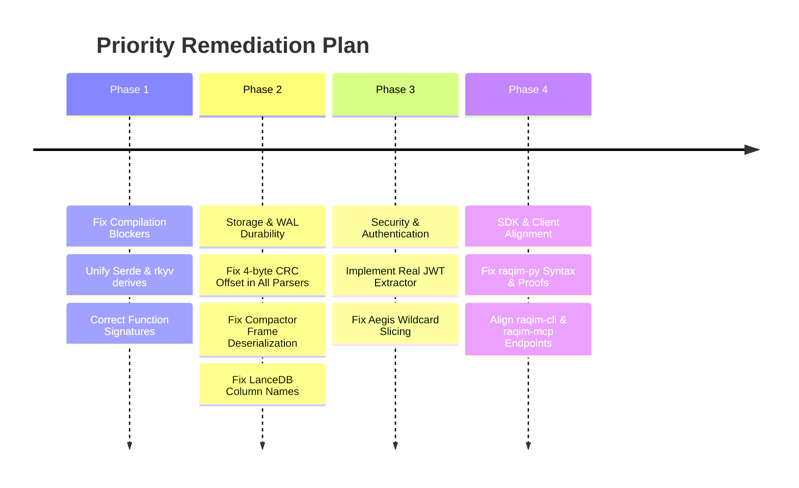

# Raqim Architecture & Security Audit Report

**Date:** 2026-08-14  
**Scope:** `raqim-core`, `raqim-cli`, `raqim-py`, `raqim-mcp`, `raqim-agent-sdk`, `raqim-siege`  
**Status:** Comprehensive Codebase Review

---

## Executive Summary

The Raqim ecosystem sets out an ambitious vision for sovereign agentic runtimes: combining Merkle DAG audit trails, deterministic WASM sandbox replay, Loro CRDT swarm coordination, zero-copy shared memory data planes, and out-of-band context eviction.

However, in its current state, **the codebase suffers from fundamental compilation failures, critical security bypasses, catastrophic data loss in the storage pipeline, and broken client-server contracts.**



---

## Severity Assessment Matrix

| Category | High / Critical | Medium | Low / Polish |
| :--- | :---: | :---: | :---: |
| **Security & Authentication** | 4 | 2 | 1 |
| **Data Durability & Storage** | 5 | 2 | 0 |
| **Concurrency & Runtime** | 3 | 1 | 0 |
| **Client & SDK Contracts** | 4 | 2 | 1 |
| **Build & Tooling Health** | 3 | 1 | 0 |

---

## 1. Critical Security Vulnerabilities

### 1.1 Complete Authentication & Authorization Bypass
* **Target File:** [`raqim-core/src/api.rs`](file:///Ubuntu-22.04/home/muhammad/projects/raqim/synapse/raqim-core/src/api.rs#L180-L200)
* **Severity:** **CRITICAL**

> [!CAUTION]
> All administrative and control plane endpoints (`/v1/admin/*`, `/v1/time_travel/*`, `/v1/state/*`, `/v1/system_boot_agent`) are completely open to unauthenticated remote callers.

#### Root Cause
The Axum header extractor `ValidatedIdentity` returns a hardcoded mock superadmin claim:
```rust
#[async_trait]
impl<S> FromRequestParts<S> for ValidatedIdentity
where S: Send + Sync {
    type Rejection = StatusCode;
    async fn from_request_parts(_parts: &mut Parts, _state: &S) -> Result<Self, Self::Rejection> {
        Ok(ValidatedIdentity(EnterpriseClaim {
            sub: "local_standalone".to_string(),
            features: vec![
                "global_crdt".to_string(),
                "global_a2a".to_string(),
                "global_aegis".to_string(),
                "time_travel".to_string(),
            ],
            exp: 9999999999,
        }))
    }
}
```
No JWT decoding, signature check, or token expiration audit is performed.

---

### 1.2 Unauthenticated Arbitrary Binary Upload & Execution
* **Target File:** [`raqim-core/src/api.rs`](file:///Ubuntu-22.04/home/muhammad/projects/raqim/synapse/raqim-core/src/api.rs#L770-L810)
* **Severity:** **CRITICAL**

#### Root Cause
The `/v1/system_boot_agent` endpoint accepts multipart uploads and writes files directly into `./plugins/` based solely on a `.wasm` file extension and hex-parseable name prefix. There is **no verification against the Swarm Master Key**, enabling remote unauthenticated actors to deploy arbitrary WASM bytecode into the execution environment.

---

### 1.3 Aegis Firewall Out-of-Bounds Slicing Panic (DoS)
* **Target File:** [`raqim-core/src/aegis.rs`](file:///Ubuntu-22.04/home/muhammad/projects/raqim/synapse/raqim-core/src/aegis.rs#L305-L320)
* **Severity:** **HIGH**

#### Root Cause
When evaluating blocked wildcard patterns, the code attempts to slice beyond the string boundary:
```rust
for blocked in &live_policy.blocked_namespaces {
    let match_found = if blocked.ends_with("*") {
        intent_path.starts_with(&blocked[..blocked.len() + 1]) // <-- PANIC: len() + 1
    } else {
        intent_path == blocked
    };
    ...
}
```
Any incoming packet targeting a blocked wildcard namespace causes a runtime panic and kills the worker thread.

---

### 1.4 Race Condition in Token Bucket Rate Limiting
* **Target File:** [`raqim-core/src/aegis.rs`](file:///Ubuntu-22.04/home/muhammad/projects/raqim/synapse/raqim-core/src/aegis.rs#L35-L75)
* **Severity:** **HIGH**

#### Root Cause
`AtomicTokenBucket::check_and_consume` executes uncoordinated `load` and `store` sequences with `Ordering::Relaxed`. Under concurrent load, multiple threads compute overlapping refill increments, corrupting token counts and allowing rate-limit bypassing.

---

## 2. Catastrophic Data Loss & Storage Pipeline Flaws

### 2.1 Compactor Destroys All Rotated WAL Files Without Archiving
* **Target File:** [`raqim-core/src/compactor.rs`](file:///Ubuntu-22.04/home/muhammad/projects/raqim/synapse/raqim-core/src/compactor.rs#L90-L150)
* **Severity:** **CRITICAL (PERMANENT DATA LOSS)**

```
Disk Format:       [4B Length] [4B CRC32] [Payload: Vec<OpLog>]
Compactor Reads:   [4B Length] [Payload Starts at CRC32] (Tries to deserialize as single OpLog)
Result:            Deserialization Fails -> logs_to_archive is Empty -> fs::remove_file() executes
```

#### Detailed Breakdown
1. `WalEngine::write_batch_to_disk` writes frames formatted as:
   - `[4-byte len_prefix][4-byte crc32][payload_bytes: Vec<OpLog>]`
2. `WalCompactor::execute_compaction` reads 4 bytes for length, **fails to skip the 4-byte CRC32**, and attempts to deserialize the slice as `OpLog` rather than `Vec<OpLog>`.
3. Every frame in the segment fails to deserialize; `logs_to_archive` remains empty.
4. The compactor reaches line 135:
   ```rust
   if logs_to_archive.is_empty() {
       let _ = fs::remove_file(processing_path);
       return;
   }
   ```
5. **Impact:** Every rotated WAL file is permanently deleted from disk without any records being written to LanceDB.

---

### 2.2 Memory Safety Violations via `unsafe { access_unchecked }` Across WAL Scans
* **Target Files:** 
  - [`raqim-core/src/nucleus.rs`](file:///Ubuntu-22.04/home/muhammad/projects/raqim/synapse/raqim-core/src/nucleus.rs#L250-L380) (`lexical_scan`, `fetch_hot_timeline`, `get_highest_tx_id`)
  - [`raqim-core/src/memory_router.rs`](file:///Ubuntu-22.04/home/muhammad/projects/raqim/synapse/raqim-core/src/memory_router.rs#L100-L130) (`scan_wal_zero_copy`, `rebuild_agent_timeline`)
  - [`raqim-core/src/main.rs`](file:///Ubuntu-22.04/home/muhammad/projects/raqim/synapse/raqim-core/src/main.rs#L360-L390)
* **Severity:** **HIGH**

#### Root Cause
WAL reading routines consistently fail to offset the 4-byte CRC header and cast the byte slice directly to `Archived<OpLog>` instead of `Archived<Vec<OpLog>>`. Invoking `unsafe { rkyv::access_unchecked }` on corrupted offsets triggers **Undefined Behavior, illegal memory reads, and SIGSEGV crashes**.

---

### 2.3 Phoenix Boot Hydration Loop Is Dead on Arrival
* **Target File:** [`raqim-core/src/main.rs`](file:///Ubuntu-22.04/home/muhammad/projects/raqim/synapse/raqim-core/src/main.rs#L365-L380)
* **Severity:** **HIGH**

#### Root Cause
```rust
let mut len_bytes = [0u8; 4];
...
if offset + entry_len > len_bytes.len() {
    break;
}
```
`len_bytes.len()` is the size of the 4-byte stack buffer (`4`). Because `offset + entry_len` is greater than 4 on the first entry, the hydration loop breaks immediately on startup, reconstructing **zero** state.

---

### 2.4 WORM Witness File Name Mismatch & Extension Parsing Bug
* **Target File:** [`raqim-core/src/witness.rs`](file:///Ubuntu-22.04/home/muhammad/projects/raqim/synapse/raqim-core/src/witness.rs#L95-L165)
* **Severity:** **HIGH**

#### Root Cause
1. `anchor_batch` writes files as `batch_{:08}.json`.
2. `fetch_bundle_from_witness` searches for `bundle_{:08}.json`. It can never locate archived bundles.
3. `load_local_witness` checks `entry.path().extension() == Some(".json")`. In Rust, `Path::extension()` returns `"json"` (without the dot), so the condition is always false and zero witnesses are ever loaded.

---

### 2.5 LanceDB Schema Mismatches & Crashing Column Queries
* **Target File:** [`raqim-core/src/lancedb_store.rs`](file:///Ubuntu-22.04/home/muhammad/projects/raqim/synapse/raqim-core/src/lancedb_store.rs)
* **Severity:** **HIGH**

#### Root Cause
1. The table schema registers the transaction identifier column as `"tx_id"`. However, `semantic_search()`, `fetch_historical_timeline()`, and `memory_router.rs` query `.column_by_name("transaction_id").unwrap()`, causing runtime panics on `None`.
2. `save_snapshot()` writes `tx_id` as an `Int64Array`, but `fetch_closest_snapshot()` downcasts it as a `StringArray`, panicking on downcast failure.

---

### 2.6 CRDT 64-bit Truncation of UUIDv7 128-bit TxIDs
* **Target File:** [`raqim-core/src/state.rs`](file:///Ubuntu-22.04/home/muhammad/projects/raqim/synapse/raqim-core/src/state.rs#L70-L80)
* **Severity:** **MEDIUM**

#### Root Cause
```rust
let _ = record_entry.insert("tx_id", state.transaction_id as i64);
```
UUIDv7 encodes its 48-bit millisecond timestamp in the highest bits of the 128-bit integer. Casting `u128 as i64` discards the entire timestamp portion, destroying global temporal ordering and causality within the Loro CRDT.

---

## 3. Concurrency, Async & Sandbox Logic Flaws

### 3.1 Nested Tokio Runtime Panic in WebSocket Handler
* **Target File:** [`raqim-core/src/api.rs`](file:///Ubuntu-22.04/home/muhammad/projects/raqim/synapse/raqim-core/src/api.rs#L240-L255)
* **Severity:** **HIGH**

#### Root Cause
```rust
match tokio::runtime::Handle::current().block_on(timeout(Duration::from_secs(15), reply_rx)) { ... }
```
Calling `Handle::block_on` inside an active Tokio async worker thread causes an immediate panic (`"Cannot start a runtime from within a runtime"`).

---

### 3.2 Wasmtime Synchronous Invocation with Async Host Functions
* **Target File:** [`raqim-core/src/sandbox.rs`](file:///Ubuntu-22.04/home/muhammad/projects/raqim/synapse/raqim-core/src/sandbox.rs#L400-L630)
* **Severity:** **HIGH**

#### Root Cause
The engine registers async host functions (e.g., `func_wrap_async` for `host_await_a2a_question`), but executes the WASM entrypoint synchronously with `agent_main.call(&mut store, ())` instead of `call_async`. Wasmtime requires `call_async` when async host functions are present in the linker.

---

### 3.3 Network Side-Effects Are Never Recorded in Live Execution
* **Target File:** [`raqim-core/src/sandbox.rs`](file:///Ubuntu-22.04/home/muhammad/projects/raqim/synapse/raqim-core/src/sandbox.rs#L140-L165)
* **Severity:** **HIGH**

#### Root Cause
In `host_emit_thought`, the recorder clones `layers.replay_responses` instead of `layers.live_responses`:
```rust
let seeds_to_save = layers.live_seeds.clone();
let network_to_save = layers.replay_responses.clone(); // <-- BUG: Must be live_responses
```
Live HTTP and A2A responses are discarded, leaving the flight recorder empty and rendering deterministic time-travel replay impossible.

---

## 4. Client & SDK Inconsistencies

### 4.1 `raqim-cli`
* **Target File:** [`raqim-cli/src/main.rs`](file:///Ubuntu-22.04/home/muhammad/projects/raqim/synapse/raqim-cli/src/main.rs)

| Command | Issue | Impact |
| :--- | :--- | :--- |
| `keys forge` | Hits `/v1/admin/ca/mint` | Endpoint does not exist in daemon (Returns `404 Not Found`). |
| `aegis list` | Hits `/v1/admin/quarantine` | Daemon route is `/v1/aegis/quarantine_list` (Returns `404 Not Found`). |
| `aegis lift` | Sends `{"agent_id": ...}` | Daemon expects `agent_hex` and `system_prompt_override` (Fails deserialization). |
| `time-travel` | Sends `{"target_tx_id": ..., "fork_config": null}` | Daemon expects `agent_hex` and non-null `ForkConfig` (Fails deserialization). |
| Default URL | Points to `http://127.0.0.1:8081` | Daemon default port is `8080`. |

---

### 4.2 `raqim-py`
* **Target Files:** [`raqim-py/raqim/client.py`](file:///Ubuntu-22.04/home/muhammad/projects/raqim/synapse/raqim-py/raqim/client.py), [`raqim-py/src/lib.rs`](file:///Ubuntu-22.04/home/muhammad/projects/raqim/synapse/raqim-py/src/lib.rs)

1. **`json.dump` vs `json.dumps`:** `record_effect()` calls `json.dump(result)`, raising `TypeError: dump() missing 1 required positional argument: 'fp'`.
2. **Decode vs Encode:** `record_effect()` calls `base64.b64decode` on fresh output bytes instead of `b64encode`.
3. **Replay Encoding Argument:** Replay mode calls `raw_byte.decode(raw_byte)` passing bytes as the encoding string.
4. **Offline Merkle Proof Typos:** `verify_state_proof_offline()` calls `hasher.updapte` and references `proof_dict["sibling_hahses_hex"]`, throwing runtime attribute and key errors.
5. **A2A WebSocket Protocol Incompatibility:** `ask_swarm()` formats `public_key` as a list of integers and omits `capability_cert`. The daemon expects a hex string and a required capability certificate.

---

### 4.3 `raqim-mcp`
* **Target File:** [`raqim-mcp/src/main.rs`](file:///Ubuntu-22.04/home/muhammad/projects/raqim/synapse/raqim-mcp/src/main.rs)

1. **Stdout Pollution in Stdio Transport:** Prints banner text (`println!("Bismillah...")`) directly to `stdout`, corrupting the MCP JSON-RPC protocol stream.
2. **WebSocket Method Mismatch:** In `api.rs`, `/v1/mcp/ws` is registered as a `POST` route instead of `GET`, causing all WebSocket connection handshakes to fail with `405 Method Not Allowed`.
3. **Hardcoded Endpoints:** Hardcodes `127.0.0.1:8080` in TCP connector logic rather than respecting environment configuration.

---

## 5. Build & Startup Blockers

```
Compiling Errors:
├── raqim-core: 16 compile errors (trait bounds on OpLog, mismatched arg counts in api.rs, syntax error in axon.rs)
├── raqim-siege: 1 compile error (missing AsyncWriteExt trait for TcpStream::write_all)
└── raqim-daemon runtime: Missing field `witness_path` in raqim.toml causes immediate panic on boot
```

1. **Missing Serde Traits on `OpLog`:** `witness.rs` requires `OpLog: serde::Serialize + serde::Deserialize`, but `OpLog` only derives `rkyv` traits.
2. **Function Argument Mismatches:** Calls to `verify_session_lineage` and `authorize_packet_fast` across `api.rs` and `main.rs` have mismatched parameter counts.
3. **Invalid Route Syntax in Axum:** `.route("v1/effect/get", ...)` lacks a leading `/`, triggering a panic on Axum router initialization.
4. **Missing Configuration Keys:** `config.rs` requires `daemon.witness_path` in `raqim.toml`, but it is missing from the default file.

---

## Recommended Remediation Roadmap



1. **Phase 1 — Compilation & Syntax Alignment:**
   - Add `#[derive(Serialize, Deserialize)]` to `OpLog`, `AgentState`, and `AgentStatus`.
   - Fix all calls to `verify_session_lineage` (pass agent public key) and `authorize_packet_fast` (pass timestamp).
   - Fix `eprintln!` syntax and slice indexing in `axon.rs`.
   - Add leading `/` to all Axum routes.

2. **Phase 2 — Unified WAL Framing & Data Recovery:**
   - Create a single, canonical `WalFrameReader` and `WalFrameWriter` used by `nucleus.rs`, `compactor.rs`, `memory_router.rs`, and `main.rs`.
   - Ensure the 4-byte CRC32 header is skipped and batches are deserialized as `Vec<OpLog>`.
   - Update `compactor.rs` so that files are only deleted after verified persistence into LanceDB.
   - Standardize LanceDB columns to `"tx_id"` everywhere.

3. **Phase 3 — Security Hardening:**
   - Implement real JWT verification against `RAQIM_PUBLIC_KEY` in `ValidatedIdentity`.
   - Fix `blocked.len() - 1` slice logic in `aegis.rs`.
   - Replace relaxed token bucket operations with atomic compare-and-swap or mutex-guarded state.

4. **Phase 4 — SDK & Protocol Harmonization:**
   - Fix `client.py` (`json.dumps`, `b64encode`, proof typos, and WebSocket payload schema).
   - Clean up stdio transport in `raqim-mcp` (switch logging to `eprintln!`).
   - Implement `/v1/admin/ca/mint` in `raqim-core` or update `raqim-cli` to use local key generation.
