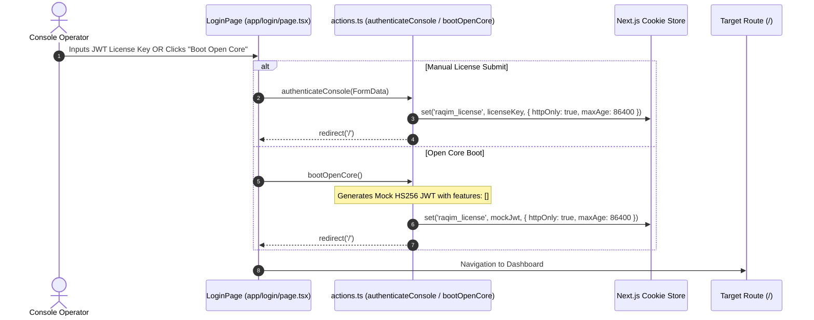
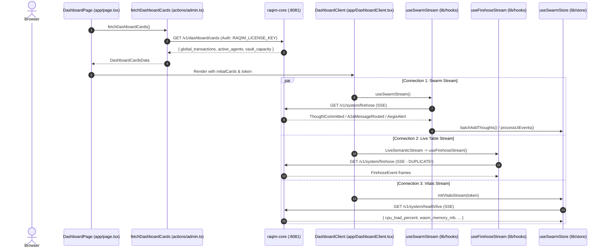
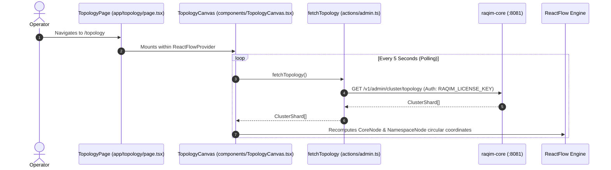
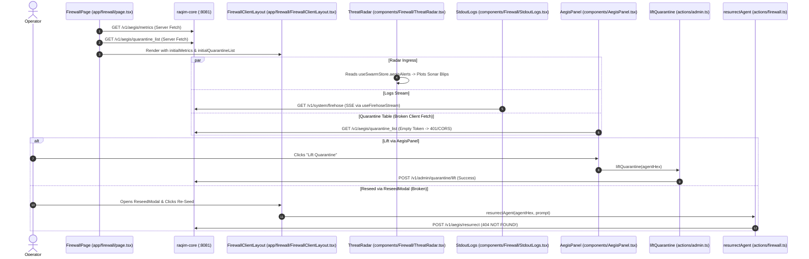
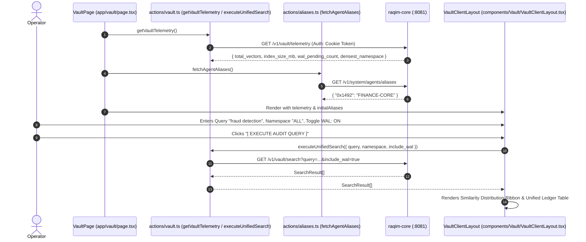
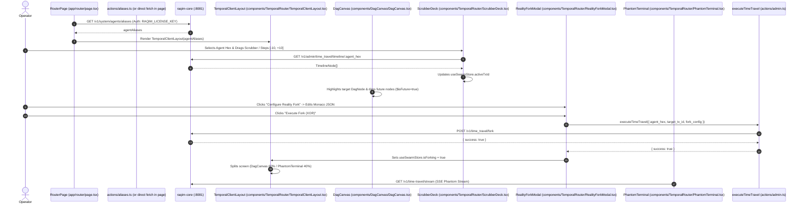
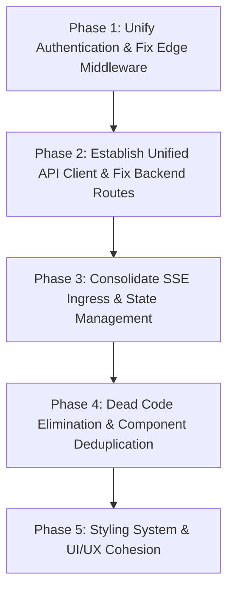

# Raqim Console Architecture & Data Lifecycle Audit Report

**Date:** 2026-08-18  
**Scope:** `raqim-console` (Next.js 16 App Router, React 19, Zustand, @xyflow/react, Framer Motion, Styled-Components, TailwindCSS)  
**Status:** Complete, Unvarnished Codebase & Data Flow Audit  
**Target:** Autonomous Deep Research & Engineering Remediation

---

## Executive Summary

The `raqim-console` package serves as the primary GUI operator console and control plane interface for the Raqim Sovereign Agentic Daemon (`raqim-core`). Its declared mission is to provide zero-copy, real-time observability over Merkle DAG execution traces, live Loro CRDT swarm topology, Aegis cryptographic firewall interdictions, LanceDB vector audit trails, and deterministic WASI time-travel replay (reality forking).

However, a brutal, line-by-line forensic audit reveals that **`raqim-console` in its current state is functionally crippled by fatal middleware logic inversions, broken client-server authentication contracts, severe component duplication/fragmentation, orphaned dead code, dual competing SSE subscriptions, and hardcoded mock data masquerading as live telemetry.**

```mermaid
graph TD
    subgraph Client Browser [Client Tier: Browser]
        UI_Dash[Dashboard Page]
        UI_Fire[Firewall Page]
        UI_Vault[Vault Page]
        UI_Topo[Topology Page]
        UI_Router[Temporal Router]
        ZStore[Zustand useSwarmStore]
    end

    subgraph Broken_Data_Plane [Broken Ingress & Auth Gateways]
        DocCookie["document.cookie (Returns EMPTY for HttpOnly)"]
        MisplacedMW["src/app/middleware.ts (Ignored by Next.js & Throws on Valid JWT)"]
        EnvKey["process.env.RAQIM_LICENSE_KEY (Server Action Bypass)"]
    end

    subgraph Server_Actions [Next.js Server Actions Layer]
        Act_Dash[actions/dashboard.ts]
        Act_Admin[actions/admin.ts]
        Act_Vault[actions/vault.ts]
        Act_Fire[actions/firewall.ts]
        Act_Temp[actions/temporal.ts]
        Act_Alias[actions/aliases.ts]
    end

    subgraph Backend_Daemon [raqim-core Axum Daemon (Port 8081)]
        Core_Cards["/v1/dashboard/cards"]
        Core_Firehose["/v1/system/firehose (SSE)"]
        Core_Health["/v1/system/health/live (SSE)"]
        Core_Aegis["/v1/aegis/quarantine_list"]
        Core_Lift["/v1/admin/quarantine/lift"]
        Core_Vault["/v1/vault/search & telemetry"]
        Core_Topo["/v1/admin/cluster/topology"]
        Core_Fork["/v1/admin/time_travel"]
        NonExistent["404: /v1/aegis/resurrect (Dead Route)"]
    end

    UI_Dash -->|Double SSE Connection| Core_Firehose
    UI_Dash -->|SSE Stream| Core_Health
    UI_Dash -->|Server Component Fetch| Act_Admin --> Core_Cards
    
    UI_Fire -->|Client fetch via document.cookie: EMPTY BEARER| Core_Aegis
    UI_Fire -->|ReseedModal hits non-existent route| Act_Fire --> NonExistent
    UI_Fire -->|AegisPanel lift action| Act_Admin --> Core_Lift

    UI_Vault -->|executeUnifiedSearch| Act_Vault --> Core_Vault
    UI_Topo -->|5s Polling via Server Action| Act_Admin --> Core_Topo
    UI_Topo -.->|Store Bootstrap Fallback| MockGen[mockGenerator.ts]

    UI_Router -->|RealityForkModal| Act_Admin --> Core_Fork
    UI_Router -->|PhantomTerminal SSE: Empty Token| Core_Firehose

    DocCookie -.->|Causes 401 Unauth in Client Fetches| Core_Aegis
    MisplacedMW -.->|Never Run / Inverted Regex| Server_Actions
```

---

## Severity Assessment Matrix

| Category | Critical / Blocker | High | Medium | Architectural Debt |
| :--- | :---: | :---: | :---: | :---: |
| **Authentication & Middleware** | 3 | 1 | 1 | 0 |
| **Data Flow & Server Action Contracts** | 3 | 2 | 1 | 0 |
| **Component Duplication & Dead Code** | 0 | 4 | 3 | 2 |
| **State Management & SSE Ingress** | 2 | 2 | 1 | 0 |
| **Styling & Rendering Architecture** | 0 | 1 | 3 | 2 |

---

## 1. Top 10 Critical Flaws & Architectural Vulnerabilities

### 1.1 Fatal Middleware Inversion & Misplaced File
* **Target File:** [`src/app/middleware.ts`](file:///Ubuntu-22.04/home/muhammad/projects/raqim/synapse/raqim-console/src/app/middleware.ts#L1-L45)
* **Severity:** **CRITICAL**

> [!CAUTION]
> The Next.js Edge Middleware is completely dysfunctional in two independent ways:
> 1. **Location Failure:** In Next.js 13+, middleware MUST reside in `src/middleware.ts` or the root `middleware.ts`. Placing it in `src/app/middleware.ts` causes Next.js to completely ignore it.
> 2. **Fatal Logic Inversion:** Even if moved to the correct location, the code explicitly rejects valid JWTs:
>    ```typescript
>    const token_parts = licenseCookie.value.split(".")
>    if (token_parts.length === 3) throw new Error("Invalidi JWT Morphology");
>    ```
>    Standard valid JWTs have exactly 3 parts (`header.payload.signature`). This condition throws on every legitimate token, evicting every valid session and causing an infinite redirect loop to `/login`.

---

### 1.2 The `HttpOnly` Cookie Blindspot (Client-Side Auth Evaporation)
* **Target Files:** [`src/components/AegisPanel.tsx`](file:///Ubuntu-22.04/home/muhammad/projects/raqim/synapse/raqim-console/src/components/AegisPanel.tsx#L230-L245), [`src/lib/hooks/useSwarmStream.ts`](file:///Ubuntu-22.04/home/muhammad/projects/raqim/synapse/raqim-console/src/lib/hooks/useSwarmStream.ts#L6-L15), [`src/components/TemporalRouter/PhantomTerminal.tsx`](file:///Ubuntu-22.04/home/muhammad/projects/raqim/synapse/raqim-console/src/components/TemporalRouter/PhantomTerminal.tsx#L85-L95), [`src/components/Layout/Sidebar.tsx`](file:///Ubuntu-22.04/home/muhammad/projects/raqim/synapse/raqim-console/src/components/Layout/Sidebar.tsx#L125-L135)
* **Severity:** **CRITICAL**

#### Root Cause
In [`src/app/login/actions.ts`](file:///Ubuntu-22.04/home/muhammad/projects/raqim/synapse/raqim-console/src/app/login/actions.ts#L16-L22), the license token is correctly stored as an `httpOnly: true` cookie.  
However, multiple client components attempt to read it via `document.cookie`:
```typescript
// AegisPanel.tsx & PhantomTerminal.tsx
const token = document.cookie.split('; ').find(row => row.startsWith('raqim_license='))?.split('=')[1] || '';
```
Because browser security prevents client-side JS from accessing `HttpOnly` cookies, `token` resolves to `""` (empty string).  
- In `AegisPanel.tsx`, direct client calls to `http://127.0.0.1:8081/v1/aegis/quarantine_list` send `Authorization: Bearer ` (empty), causing 401s or CORS errors.
- In `useSwarmStream.ts`, `jwtToken` falls back to `'mock_license_key_123'`.
- In `Sidebar.tsx`, the logout action `document.cookie = "raqim_license=; path=/; expires=..."` completely fails to clear the `HttpOnly` cookie, meaning users **cannot log out**.

---

### 1.3 Split-Brain Authorization Strategy Across Server Actions
* **Target Files:** [`src/actions/admin.ts`](file:///Ubuntu-22.04/home/muhammad/projects/raqim/synapse/raqim-console/src/actions/admin.ts#L7-L14), [`src/actions/dashboard.ts`](file:///Ubuntu-22.04/home/muhammad/projects/raqim/synapse/raqim-console/src/actions/dashboard.ts#L10-L20), [`src/actions/vault.ts`](file:///Ubuntu-22.04/home/muhammad/projects/raqim/synapse/raqim-console/src/actions/vault.ts#L30-L40), [`src/actions/temporal.ts`](file:///Ubuntu-22.04/home/muhammad/projects/raqim/synapse/raqim-console/src/actions/temporal.ts#L5-L15)
* **Severity:** **CRITICAL**

#### Root Cause
There is no unified backend fetch client. Server Actions use three contradictory auth strategies:
1. `src/actions/admin.ts` ignores session cookies entirely and reads `process.env.RAQIM_LICENSE_KEY` via `getHeaders()`.
2. `src/actions/vault.ts`, `src/actions/aliases.ts`, `src/actions/firewall.ts`, and `src/actions/dashboard.ts` read `(await cookies()).get('raqim_license')`.
3. `src/actions/temporal.ts` passes **no Authorization header at all**:
   ```typescript
   // src/actions/temporal.ts
   const res = await fetch("http://localhost:8081/v1/admin/time_travel/fork", {
     method: "POST",
     headers: { "Content-Type": "application/json" }, // NO AUTH HEADER
     body: JSON.stringify({ agent_hex, target_tx_id, fork_config })
   });
   ```

---

### 1.4 Route Desynchronization & Dead Ingress Endpoints
* **Target Files:** [`src/actions/firewall.ts`](file:///Ubuntu-22.04/home/muhammad/projects/raqim/synapse/raqim-console/src/actions/firewall.ts#L15-L25), [`src/components/Firewall/ReseedModal.tsx`](file:///Ubuntu-22.04/home/muhammad/projects/raqim/synapse/raqim-console/src/components/Firewall/ReseedModal.tsx#L125-L140), [`raqim-core/src/api.rs`](file:///Ubuntu-22.04/home/muhammad/projects/raqim/synapse/raqim-core/src/api.rs#L1425-L1445)
* **Severity:** **HIGH**

#### Root Cause
- In `src/actions/firewall.ts`, `resurrectAgent` posts to `http://127.0.0.1:8081/v1/aegis/resurrect`.  
  **This route does NOT exist in `raqim-core`**. In `raqim-core/src/api.rs`, the endpoint is defined as `POST /v1/admin/quarantine/lift`.
- In `src/components/Firewall/ReseedModal.tsx`, clicking `[ RE-SEED DAEMON ]` calls `resurrectAgent` and therefore guaranteed returns a 404 error from the daemon.
- Meanwhile, `src/actions/admin.ts` defines `liftQuarantine` which hits the correct `/v1/admin/quarantine/lift`, but `ReseedModal` does not import or use it.

---

### 1.5 Duplicate SSE Firehose Subscriptions & Redundant Event Loops
* **Target Files:** [`src/lib/hooks/useSwarmStream.ts`](file:///Ubuntu-22.04/home/muhammad/projects/raqim/synapse/raqim-console/src/lib/hooks/useSwarmStream.ts#L25-L100), [`src/lib/hooks/useFirehoseStream.ts`](file:///Ubuntu-22.04/home/muhammad/projects/raqim/synapse/raqim-console/src/lib/hooks/useFirehoseStream.ts#L20-L75), [`src/app/DashboardClient.tsx`](file:///Ubuntu-22.04/home/muhammad/projects/raqim/synapse/raqim-console/src/app/DashboardClient.tsx#L40-L50), [`src/components/LiveSemanticStream.tsx`](file:///Ubuntu-22.04/home/muhammad/projects/raqim/synapse/raqim-console/src/components/LiveSemanticStream.tsx#L180-L195)
* **Severity:** **HIGH**

#### Root Cause
Two completely independent hooks subscribe to the exact same backend SSE endpoint (`/v1/system/firehose`):
1. `useSwarmStream()` runs inside `DashboardClient.tsx` and `TemporalClientLayout.tsx`. It buffers events and flushes them to the global `useSwarmStore` via `requestAnimationFrame`.
2. `useFirehoseStream(token)` runs inside `LiveSemanticStream.tsx` and `StdoutLogs.tsx`. It maintains its own local `useState` array of events.
- On the Dashboard page, the browser opens **two concurrent SSE connections** to the same stream.
- Events processed by `useFirehoseStream` bypass `useSwarmStore`, while events in `useSwarmStore` are not shared with `LiveSemanticStream`.

---

### 1.6 Triplicate Reality Forking & Scrubber Implementations
* **Target Files:** `src/components/TemporalRouter/*` vs `src/components/TimeMachine/*` vs `src/components/TimeMachineModal.tsx`
* **Severity:** **HIGH**

#### Root Cause
There are three parallel, conflicting implementations of the Time Machine / Reality Fork feature:
1. **Implementation A (Active Route `/router`):** [`src/components/TemporalRouter/TemporalClientLayout.tsx`](file:///Ubuntu-22.04/home/muhammad/projects/raqim/synapse/raqim-console/src/components/TemporalRouter/TemporalClientLayout.tsx), using `ScrubberDeck.tsx`, `RealityForkModal.tsx`, and `PhantomTerminal.tsx`.
2. **Implementation B (Orphaned / Unused):** [`src/components/TimeMachine/NLEScrubber.tsx`](file:///Ubuntu-22.04/home/muhammad/projects/raqim/synapse/raqim-console/src/components/TimeMachine/NLEScrubber.tsx) and [`src/components/TimeMachine/RealityForkDrawer.tsx`](file:///Ubuntu-22.04/home/muhammad/projects/raqim/synapse/raqim-console/src/components/TimeMachine/RealityForkDrawer.tsx).
3. **Implementation C (Orphaned / Unused):** [`src/components/TimeMachineModal.tsx`](file:///Ubuntu-22.04/home/muhammad/projects/raqim/synapse/raqim-console/src/components/TimeMachineModal.tsx).

Each of these implements its own separate state updates, Monaco editor instances, and server action calls.

---

### 1.7 Hardware Vitals Memory Unit Calculation Bug
* **Target File:** [`src/lib/hooks/useHardwareVitals.ts`](file:///Ubuntu-22.04/home/muhammad/projects/raqim/synapse/raqim-console/src/lib/hooks/useHardwareVitals.ts#L22-L32), [`src/app/DashboardClient.tsx`](file:///Ubuntu-22.04/home/muhammad/projects/raqim/synapse/raqim-console/src/app/DashboardClient.tsx#L185-L195)
* **Severity:** **MEDIUM**

#### Root Cause
In `useHardwareVitals.ts`:
```typescript
return {
  cpu_percent: currentVitals.cpu_load_percent,
  wasm_memory_gb: currentVitals.wasm_memory_mb, // <-- BUG: Direct assignment of MB to GB
  wasm_memory_max_gb: 16.0,
  mesh_latency_ms: currentVitals.mesh_latency_ms,
  core_temp_c: currentVitals.core_temp_celcius,
};
```
If `raqim-core` reports `wasm_memory_mb = 512`, `wasm_memory_gb` becomes `512`. In `DashboardClient.tsx`, this is displayed as `512.0GB / 16.0GB` and the progress bar calculation overflows to 100%.

---

### 1.8 Dead & Orphaned Code Artifacts
* **Target Files:**
  - [`src/components/Vault/SemanticConstellation.tsx`](file:///Ubuntu-22.04/home/muhammad/projects/raqim/synapse/raqim-console/src/components/Vault/SemanticConstellation.tsx) (Orphaned SVG visualizer replaced by linear ribbon in `VaultClientLayout.tsx`)
  - [`src/components/RequiresFeature.tsx`](file:///Ubuntu-22.04/home/muhammad/projects/raqim/synapse/raqim-console/src/components/RequiresFeature.tsx) & [`src/components/FeatureGateOverlay.tsx`](file:///Ubuntu-22.04/home/muhammad/projects/raqim/synapse/raqim-console/src/components/FeatureGateOverlay.tsx) (Zero imports across the entire app)
  - [`src/components/Firewall/LiftQuarantineModal.tsx`](file:///Ubuntu-22.04/home/muhammad/projects/raqim/synapse/raqim-console/src/components/Firewall/LiftQuarantineModal.tsx) (Unreferenced modal replaced by inline button / `ReseedModal`)
  - [`src/components/Topology/ClusterNode.tsx`](file:///Ubuntu-22.04/home/muhammad/projects/raqim/synapse/raqim-console/src/components/Topology/ClusterNode.tsx), [`src/components/Topology/AgentNode.tsx`](file:///Ubuntu-22.04/home/muhammad/projects/raqim/synapse/raqim-console/src/components/Topology/AgentNode.tsx), [`src/components/Topology/A2aEdge.tsx`](file:///Ubuntu-22.04/home/muhammad/projects/raqim/synapse/raqim-console/src/components/Topology/A2aEdge.tsx) (Replaced by inline nodes in `TopologyCanvas.tsx`)
  - [`src/app/page.module.css`](file:///Ubuntu-22.04/home/muhammad/projects/raqim/synapse/raqim-console/src/app/page.module.css), [`src/components/DagCanvas/DagCanvas.module.css`](file:///Ubuntu-22.04/home/muhammad/projects/raqim/synapse/raqim-console/src/components/DagCanvas/DagCanvas.module.css), [`src/components/Layout/Layout.module.css`](file:///Ubuntu-22.04/home/muhammad/projects/raqim/synapse/raqim-console/src/components/Layout/Layout.module.css), [`src/components/TimeMachine/TimeMachine.module.css`](file:///Ubuntu-22.04/home/muhammad/projects/raqim/synapse/raqim-console/src/components/TimeMachine/TimeMachine.module.css) (CSS module files containing unused class declarations)
* **Severity:** **HIGH (Architectural Debt)**

---

### 1.9 Hardcoded Mock Telemetry Masquerading as Live System Metrics
* **Target Files:** [`src/components/Layout/MainLayout.tsx`](file:///Ubuntu-22.04/home/muhammad/projects/raqim/synapse/raqim-console/src/components/Layout/MainLayout.tsx#L55-L80), [`src/components/Layout/Sidebar.tsx`](file:///Ubuntu-22.04/home/muhammad/projects/raqim/synapse/raqim-console/src/components/Layout/Sidebar.tsx#L250-L265), [`src/lib/store/useSwarmStore.ts`](file:///Ubuntu-22.04/home/muhammad/projects/raqim/synapse/raqim-console/src/lib/store/useSwarmStore.ts#L170-L185)
* **Severity:** **MEDIUM**

#### Details
- In `MainLayout.tsx` footer:
  - `UPTIME: 14h 22m` is static hardcoded text.
  - `v1.0.0-rc.1` is static hardcoded text.
  - `TENANT: ROOT_NODE_0x1` is static hardcoded text.
- In `Sidebar.tsx` diagnostics:
  - `Uptime: 14h 22m 09s`, `Core Latency: 1.2 ms`, `Active Peers: 08` are hardcoded static strings.
- In `useSwarmStore.ts`, `fetchInitialTopology` directly imports and runs `fetchMockTopologySnapshot()` from `mockGenerator.ts` rather than fetching real cluster data from `raqim-core`.

---

### 1.10 Inconsistent Styling Paradigm & Hydration Footprint
* **Target Files:** All components across `src/components/` and `src/app/`
* **Severity:** **MEDIUM**

#### Root Cause
The project mixes 4 conflicting styling mechanisms without clear boundaries:
1. **Tailwind CSS** (configured with extensive custom colors in `tailwind.config.ts` and imported in `globals.css`).
2. **`styled-components`** with SSR registry (`src/lib/registry.tsx`).
3. **CSS Modules** (`*.module.css` files leftover from earlier iterations).
4. **Direct inline CSS / Framer Motion animate props / raw SVG styling**.

This causes unnecessary CSS bundle bloat, CSS specificity clashes, and increased hydration cost in the browser.

---

## 2. Exhaustive Page-by-Page Audit & Data Lifecycles

---

### Page 1: `/login` (Authentication & Enclave Onboarding)



#### 1. Page Metadata & Component Hierarchy
- **File:** [`src/app/login/page.tsx`](file:///Ubuntu-22.04/home/muhammad/projects/raqim/synapse/raqim-console/src/app/login/page.tsx)
- **Rendering Mode:** Client Component (`'use client'`)
- **Layout:** Standalone full-screen container (Bypasses `MainLayout`).
- **Styling:** `styled-components` with `@keyframes glowPulse`.

#### 2. Visual Content & UI Structure
- **Logo Banner:** `raqim_os // console` header with pulsing system status indicator (`Aegis Terminal Active`).
- **Enterprise Auth Form:**
  - Input field for `license_key` (JWT format).
  - Primary button: `[ Authenticate Console ]`.
  - Inline error alert box if submission fails.
- **Open Core Fallback Form:**
  - Secondary button: `[ Boot Open Core (Local LAN) ]`.

#### 3. Complete Data Lifecycle
1. **Input Phase:** The user enters an Enterprise JWT string or clicks "Boot Open Core".
2. **Execution Phase:**
   - On license submission, `authenticateConsole(formData)` in [`src/app/login/actions.ts`](file:///Ubuntu-22.04/home/muhammad/projects/raqim/synapse/raqim-console/src/app/login/actions.ts) sets `raqim_license` cookie with `httpOnly: true, secure: prod, maxAge: 86400, path: '/'`.
   - On Open Core click, `bootOpenCore()` synthesizes a mock JWT payload (`{ sub: 'open-core-user', features: [] }`) and sets the `raqim_license` cookie.
3. **Redirection:** Both actions invoke Next.js `redirect('/')`.

#### 4. Vulnerabilities & Gotchas
- **No Backend Validation:** The login action sets whatever string is entered into cookies **without verifying its cryptographic signature against `raqim-core`**.
- **Edge Middleware Bypass:** Because `src/app/middleware.ts` is in the wrong directory, no edge verification is performed on subsequent page navigations.

---

### Page 2: `/` (Dashboard / Overview Terminal)



#### 1. Page Metadata & Component Hierarchy
- **Server Page:** [`src/app/page.tsx`](file:///Ubuntu-22.04/home/muhammad/projects/raqim/synapse/raqim-console/src/app/page.tsx)
- **Client Root:** [`src/app/DashboardClient.tsx`](file:///Ubuntu-22.04/home/muhammad/projects/raqim/synapse/raqim-console/src/app/DashboardClient.tsx)
- **Child Components:**
  - [`src/components/LiveSemanticStream.tsx`](file:///Ubuntu-22.04/home/muhammad/projects/raqim/synapse/raqim-console/src/components/LiveSemanticStream.tsx)
  - `Recharts` `AreaChart` (CPU Load History)
  - Styled `ProgressBar` meters for Hardware Vitals.

#### 2. Visual Content & UI Structure
- **Top 4 Metric Cards:**
  1. **Global Transactions:** Displays `initialCards.global_transactions` (formatted with `toLocaleString()`).
  2. **Active Agents:** Displays `initialCards.active_agents` (unique 60s rolling window).
  3. **Swarm Velocity (TPS):** Displays real-time `currentTps` from `useSwarmStore` (calculated via 1s rolling interval).
  4. **Vault Capacity:** Displays `initialCards.vault_capacity` (formatted via `formatNumber`).
- **Main Stream Section (2-Column Grid):**
  - **Left (2/3 width):** `<LiveSemanticStream token={token} />` displaying live ingress table (`TX_ID`, `AGENT`, `NAMESPACE`, `PAYLOAD`).
  - **Right (1/3 width):**
    - **CPU Load Area Chart:** 60-sample historical area chart using Recharts.
    - **Hardware Vitals Card:** CPU Allocation (%), WASM Memory (`GB/maxGB`), Mesh Latency (`ms`), Core Temp (`°C`).

#### 3. Complete Data Lifecycle
1. **Server Fetch:** `DashboardPage` calls `fetchDashboardCards()` from `src/actions/admin.ts`.
   - `fetchDashboardCards` sends `GET http://127.0.0.1:8081/v1/dashboard/cards` with `Authorization: Bearer ${process.env.RAQIM_LICENSE_KEY}`.
2. **Client Streaming Initialization:**
   - `useSwarmStream()` attaches to `/v1/system/firehose` and pushes `ThoughtCommitted`, `A2aMessageRouted`, and `AegisAlert` events into `useSwarmStore`.
   - `LiveSemanticStream` calls `useFirehoseStream(token)` and opens a **second concurrent SSE stream** to `/v1/system/firehose`.
   - `useHardwareVitals(token)` initiates `initVitalsStream(token)` which connects to `/v1/system/health/live` (SSE) and appends samples to `vitalsHistory`.
3. **Real-Time Rolling Math:**
   - Every 1,000ms, `useSwarmStore` computes `currentTps = state.thoughtsThisSecond`, updates `tpsHistory`, and evicts agents inactive for >60s.

#### 4. Vulnerabilities & Gotchas
- **Double SSE Connection:** Subscribing twice to `/v1/system/firehose` wastes backend resources and doubles frontend parsing overhead.
- **WASM Memory Display Overflow:** `wasm_memory_mb` is assigned directly to `wasm_memory_gb` without dividing by 1024.
- **Cut-Off Stream Table:** `LiveSemanticStream` container has `overflow-y: hidden`, preventing the operator from scrolling through incoming thoughts.

---

### Page 3: `/topology` (Active Swarm CRDT Topology Canvas)



#### 1. Page Metadata & Component Hierarchy
- **File:** [`src/app/topology/page.tsx`](file:///Ubuntu-22.04/home/muhammad/projects/raqim/synapse/raqim-console/src/app/topology/page.tsx)
- **Rendering Mode:** Client Component (`'use client'`)
- **Layout:** Wrapped in `MainLayout` (Header hidden via `isNoHeader` flag).
- **Core Component:** [`src/components/TopologyCanvas.tsx`](file:///Ubuntu-22.04/home/muhammad/projects/raqim/synapse/raqim-console/src/components/TopologyCanvas.tsx) inside `@xyflow/react` `ReactFlowProvider`.

#### 2. Visual Content & UI Structure
- **Canvas Header Overlay:**
  - Title: `ACTIVE CRDT TOPOLOGY` with animated pulsing `Observer Live` badge.
  - Active Shard Counter (`Active Shards: XX`).
- **Interactive Graph Area (`@xyflow/react`):**
  - **Center Node (`CoreNode`):** Pulsing central "Raqim Core" anchor node.
  - **Radial Cluster Nodes (`NamespaceNode`):** Shards placed deterministically along a circle (`radius = 260px`). Displays namespace name, active timelines count, CRDT operations count, and estimated memory footprint.
  - **Animated Edges:** Cyan connecting lines with animated packet flow.
- **Right Sidebar (`Active CRDT Shards`):**
  - Scrollable list of active namespaces with detailed metrics per shard.

#### 3. Complete Data Lifecycle
1. **Polling Loop:** On mount, `TopologyCanvas` executes `loadTopology()` immediately and sets a 5,000ms `setInterval`.
2. **Server Action Fetch:** `loadTopology()` calls `fetchTopology()` in `src/actions/admin.ts`.
3. **Backend Target:** `GET http://127.0.0.1:8081/v1/admin/cluster/topology` returning:
   ```json
   [
     {
       "namespace": "rqm_finance",
       "active_timelines": 4,
       "total_crdt_operation": 12840
     }
   ]
   ```
4. **Node Layout Calculation:** In `useMemo`, nodes are positioned using polar coordinates (`angle = index * 2PI / count`).

#### 4. Vulnerabilities & Gotchas
- **Orphaned Topology Components:** `src/components/Topology/ClusterNode.tsx`, `AgentNode.tsx`, and `A2aEdge.tsx` are completely unused.
- **Mock Store Bypass:** In `useSwarmStore.ts`, the store action `fetchInitialTopology()` imports `fetchMockTopologySnapshot` from `mockGenerator.ts`, creating two divergent topology pipelines.

---

### Page 4: `/firewall` (Aegis Threat Mitigation & Quarantine Forensics)



#### 1. Page Metadata & Component Hierarchy
- **Server Page:** [`src/app/firewall/page.tsx`](file:///Ubuntu-22.04/home/muhammad/projects/raqim/synapse/raqim-console/src/app/firewall/page.tsx)
- **Client Layout:** [`src/app/firewall/FirewallClientLayout.tsx`](file:///Ubuntu-22.04/home/muhammad/projects/raqim/synapse/raqim-console/src/app/firewall/FirewallClientLayout.tsx)
- **Sub-Components:**
  - [`src/components/AegisPanel.tsx`](file:///Ubuntu-22.04/home/muhammad/projects/raqim/synapse/raqim-console/src/components/AegisPanel.tsx)
  - [`src/components/Firewall/ThreatRadar.tsx`](file:///Ubuntu-22.04/home/muhammad/projects/raqim/synapse/raqim-console/src/components/Firewall/ThreatRadar.tsx)
  - [`src/components/Firewall/StdoutLogs.tsx`](file:///Ubuntu-22.04/home/muhammad/projects/raqim/synapse/raqim-console/src/components/Firewall/StdoutLogs.tsx)
  - [`src/components/Firewall/ReseedModal.tsx`](file:///Ubuntu-22.04/home/muhammad/projects/raqim/synapse/raqim-console/src/components/Firewall/ReseedModal.tsx)
  - [`src/components/Firewall/LiftQuarantineModal.tsx`](file:///Ubuntu-22.04/home/muhammad/projects/raqim/synapse/raqim-console/src/components/Firewall/LiftQuarantineModal.tsx) (Orphaned)

#### 2. Visual Content & UI Structure
- **4 Metric Cards (Top Row):**
  1. `Total Quarantined` (Red text).
  2. `Recent Interdictions` (White text).
  3. `Signature Spoofs` (Red text).
  4. `Namespace Breaches` (Amber text).
- **Center Stage (Quarantine Blocklist Table):**
  - Rendered via `<AegisPanel />` with columns: `Agent Hex`, `Violation`, `Target Path`, `Lineage Firewall` (`[ Lift Quarantine ]` button).
- **Bottom Panel (Live Stdout Monitor):**
  - Rendered via `<StdoutLogs />` with scrolling logs of dropped packets (`[AEGIS_DROP]`).
- **Right Sidebar:**
  - **Threat Radar Grid:** Circular sweep radar visualizer with sonar rings and animated threat blips plotted by hashing agent hex to angle/radius.
  - **Forensics Audit Inspector:** Detailed breakdown of the selected quarantined record.

#### 3. Complete Data Lifecycle
1. **Server Fetch Phase:** `FirewallPage` fetches initial metrics from `/v1/aegis/metrics` and quarantine list from `/v1/aegis/quarantine_list`.
2. **Client Desynchronization Phase:**
   - `FirewallClientLayout` receives `initialQuarantineList` into `useState(initialQuarantineList)`.
   - However, `<AegisPanel />` internally maintains its **own separate state** `quarantined` and runs an independent 3-second polling loop directly fetching `http://127.0.0.1:8081/v1/aegis/quarantine_list` via `document.cookie` (which sends an empty token).
3. **Interdiction Actions:**
   - Clicking `Lift Quarantine` in `AegisPanel` calls `liftQuarantine(agentHex)` in `src/actions/admin.ts` (`POST /v1/admin/quarantine/lift`).
   - Opening `ReseedModal` calls `resurrectAgent` in `src/actions/firewall.ts` (`POST /v1/aegis/resurrect`), which fails with a 404.

#### 4. Vulnerabilities & Gotchas
- **Guaranteed Reseed Failure:** `ReseedModal` points to a non-existent daemon route.
- **Client Fetch 401s:** `AegisPanel` tries to read `httpOnly` cookie from `document.cookie`.
- **State Fragmentation:** Selecting a node in `AegisPanel` does not populate the `Forensics Audit Inspector` in `FirewallClientLayout` because their states are completely isolated.

---

### Page 5: `/vault` (Unified Audit Vault & Vector Search)



#### 1. Page Metadata & Component Hierarchy
- **Server Page:** [`src/app/vault/page.tsx`](file:///Ubuntu-22.04/home/muhammad/projects/raqim/synapse/raqim-console/src/app/vault/page.tsx)
- **Client Layout:** [`src/components/Vault/VaultClientLayout.tsx`](file:///Ubuntu-22.04/home/muhammad/projects/raqim/synapse/raqim-console/src/components/Vault/VaultClientLayout.tsx)
- **Orphaned Component:** [`src/components/Vault/SemanticConstellation.tsx`](file:///Ubuntu-22.04/home/muhammad/projects/raqim/synapse/raqim-console/src/components/Vault/SemanticConstellation.tsx)

#### 2. Visual Content & UI Structure
- **Left Sidebar (`Audit Query Interface`):**
  - Search input with placeholder `Query vector space...`.
  - Namespace dropdown selector (`ALL NAMESPACES`, `rqm_finance`, `rqm_logistics`, `rqm_auth`, `rqm_telemetry`, `/a2a/negotiation`, `/mem/retrieve`).
  - Checkbox toggle: `Include Uncompacted WAL Memory`.
  - Execute Query Button (`[ EXECUTE AUDIT QUERY ]`) with scanning animation state.
  - **Vault Vitals Panel:** `Total Vectors`, `Index Size (MB)`, `Pending WAL Compaction`, `Densest Namespace`.
- **Main Content Area:**
  - **Similarity Distribution Ribbon:** Linear 1D distribution plot along an axis from 0.0 to 1.0 (Exact Match). Nodes plotted as amber dots (`HOT_WAL`) or cyan dots (`LANCEDB`) with hover tooltips.
  - **Unified Ledger Table:** Scrollable table showing `Score`, `TX_ID`, `Source` (`HOT_WAL` badge in amber vs `LANCEDB` badge in cyan), `Agent Alias`, and `Payload Preview`.

#### 3. Complete Data Lifecycle
1. **Initial SSR Data Load:** `VaultPage` executes `getVaultTelemetry()` and `fetchAgentAliases()`. Both Server Actions read `(await cookies()).get('raqim_license')` and pass Bearer auth to `/v1/vault/telemetry` and `/v1/system/agents/aliases`.
2. **Search Mutation:**
   - The user inputs search criteria and submits the form.
   - Form calls `executeUnifiedSearch({ query, namespace, include_wal })` in `src/actions/vault.ts`.
   - `executeUnifiedSearch` issues `GET http://127.0.0.1:8081/v1/vault/search?query=...&namespace=...&include_wal=true`.
   - Returned `SearchResult[]` array is stored in React state `results` and drives both the Distribution Ribbon and Ledger Table.

#### 4. Vulnerabilities & Gotchas
- **Orphaned Constellation Visualizer:** `SemanticConstellation.tsx` was built as a 2D radar constellation visualizer with orbiting SVG nodes, but was abandoned in favor of the linear ribbon without being cleaned up.
- **Hardcoded Namespace List:** The namespace dropdown is hardcoded in the client rather than dynamically populated from `telemetry` or `/v1/admin/cluster/topology`.

---

### Page 6: `/router` (Temporal Router & Reality Forking)



#### 1. Page Metadata & Component Hierarchy
- **Server Page:** [`src/app/router/page.tsx`](file:///Ubuntu-22.04/home/muhammad/projects/raqim/synapse/raqim-console/src/app/router/page.tsx)
- **Client Layout:** [`src/components/TemporalRouter/TemporalClientLayout.tsx`](file:///Ubuntu-22.04/home/muhammad/projects/raqim/synapse/raqim-console/src/components/TemporalRouter/TemporalClientLayout.tsx)
- **Active Sub-Components:**
  - [`src/components/DagCanvas/DagCanvas.tsx`](file:///Ubuntu-22.04/home/muhammad/projects/raqim/synapse/raqim-console/src/components/DagCanvas/DagCanvas.tsx) & [`DagNode.tsx`](file:///Ubuntu-22.04/home/muhammad/projects/raqim/synapse/raqim-console/src/components/DagCanvas/DagNode.tsx)
  - [`src/components/TemporalRouter/ScrubberDeck.tsx`](file:///Ubuntu-22.04/home/muhammad/projects/raqim/synapse/raqim-console/src/components/TemporalRouter/ScrubberDeck.tsx)
  - [`src/components/TemporalRouter/RealityForkModal.tsx`](file:///Ubuntu-22.04/home/muhammad/projects/raqim/synapse/raqim-console/src/components/TemporalRouter/RealityForkModal.tsx)
  - [`src/components/TemporalRouter/PhantomTerminal.tsx`](file:///Ubuntu-22.04/home/muhammad/projects/raqim/synapse/raqim-console/src/components/TemporalRouter/PhantomTerminal.tsx)
- **Dead Parallel Components:**
  - [`src/components/TimeMachine/NLEScrubber.tsx`](file:///Ubuntu-22.04/home/muhammad/projects/raqim/synapse/raqim-console/src/components/TimeMachine/NLEScrubber.tsx)
  - [`src/components/TimeMachine/RealityForkDrawer.tsx`](file:///Ubuntu-22.04/home/muhammad/projects/raqim/synapse/raqim-console/src/components/TimeMachine/RealityForkDrawer.tsx)
  - [`src/components/TimeMachineModal.tsx`](file:///Ubuntu-22.04/home/muhammad/projects/raqim/synapse/raqim-console/src/components/TimeMachineModal.tsx)

#### 2. Visual Content & UI Structure
- **Top Control Bar:**
  - Agent Enclave Selector dropdown (`GLOBAL TIMELINE` or specific agent alias).
  - Status Badge (`SYSTEM_TIMELINE_NOMINAL` in white vs `REALITY_FORK_ACTIVE` in amber).
- **Main Stage (Split Canvas):**
  - **Left (100% or 60% on fork):** Interactive ReactFlow DAG canvas displaying executed thoughts in chronological sequence with parent-child links. Active node is highlighted with glowing borders; future nodes are dimmed/grayscale.
  - **Right (0% or 40% on fork):** `<PhantomTerminal />` amber CRT stdout terminal showing live diverged sandbox execution.
- **Reality Fork Drawer / Modal:**
  - Monaco JSON code editor for configuring `override_seed`, `inject_network`, `env_overrides`, and `config_overrides`.
  - Button: `Execute Fork (XOR)` with animated loading state.
- **Bottom Scrubber Deck (`ScrubberDeck.tsx`):**
  - Step buttons (`-100`, `-10`, `-1`, `+1`, `+10`, `+100`).
  - Interactive slider track with floating `TX_ID` timestamp knob.
  - Min/Max TX bounds and current node status indicator.

#### 3. Complete Data Lifecycle
1. **Agent Alias Ingress:** `RouterPage` fetches aliases from `/v1/system/agents/aliases`.
2. **Timeline Loading:** Selecting an agent triggers `fetchAgentTimeline(selectedAgentHex)` in `src/actions/admin.ts` (`GET /v1/admin/time_travel/timeline/:agent_hex`).
3. **Temporal Scrubbing:** Moving the scrubber calls `setActiveTxId(txId)` in `useSwarmStore`. This causes `DagCanvas` to recalculate `isFuture` flags on all DAG nodes.
4. **Reality Fork Execution:**
   - Clicking `Execute Fork` calls `executeTimeTravel` in `src/actions/admin.ts` (`POST /v1/time_travel/fork`).
   - On success, `setIsForking(true)` triggers the split-screen animation.
   - `PhantomTerminal` mounts and opens an `EventSource` connection to `/v1/time-travel/stream?token=${token}`.

#### 4. Vulnerabilities & Gotchas
- **PhantomTerminal Auth Failure:** Reads `token` from `document.cookie` (empty string), causing unauthenticated stream connection.
- **Three Duplicate Drawer Modals:** The codebase contains 3 completely separate implementations of the reality fork configuration drawer.
- **Fallback Mock Aliases:** If the backend is unreachable during SSR, `RouterPage` silently falls back to hardcoded dummy IDs (`0x1492`, `0x1493`, `0x1494`).

---

## 3. Global Subsystems & State Machines

### 3.1 Global State Store (`useSwarmStore.ts`)
* **File:** [`src/lib/store/useSwarmStore.ts`](file:///Ubuntu-22.04/home/muhammad/projects/raqim/synapse/raqim-console/src/lib/store/useSwarmStore.ts)
* **Library:** `zustand`

```typescript
interface SwarmState {
  thoughts: Record<number, UiThought>;
  thoughtOrder: number[];
  activeTxId: number | null;
  tpsHistory: { time: number; tps: number }[];
  currentTps: number;
  agentLastSeen: Record<string, number>;
  thoughtsThisSecond: number;
  highestTxId: number;

  // Topology State
  topologyNodes: Node[];
  topologyEdges: Edge[];
  namespaces: string[];
  activeTopology: ClusterShard[];

  // Firewall State
  aegisAlerts: AegisRecord[];
  quarantinedAgents: string[];

  // Temporal Router State
  isPaused: boolean;
  isForking: boolean;

  // System Health Vitals
  vitalsHistory: SystemHealth[];
  currentVitals: SystemHealth | null;
  initVitalsStream: (token: string) => () => void;
  // ...
}
```

#### State Machine Mechanisms:
1. **1-Second Rolling TPS Timer:** A client-side `setInterval` runs every 1,000ms, shifting `tpsHistory` (60-element ring buffer) and pruning agents not seen in the last 60,000ms.
2. **100ms Ephemeral Edge Pruner:** A fast `setInterval` runs every 100ms calling `pruneEphemeralEdges()`, removing transient A2A query edges older than 2,000ms and deactivating node pulse animations older than 3,000ms.
3. **Mock Snapshot Injection:** `fetchInitialTopology()` statically imports `mockGenerator.ts` instead of calling `fetchTopology()`.

---

## 4. Complete Inventory Table of All Files

| File Path | Functional Role | Current Status | Issues & Debt |
| :--- | :--- | :---: | :--- |
| `src/app/layout.tsx` | Root HTML shell & Font imports | **Active** | Injects StyledComponentsRegistry and Google Fonts. |
| `src/app/globals.css` | Global styles & custom scrollbars | **Active** | Custom range slider and Tailwind directives. |
| `src/app/middleware.ts` | Edge Auth Middleware | **CRITICAL BUG** | Wrong directory (`src/app/`) and logic error (`length === 3` throws). |
| `src/app/page.tsx` | Dashboard SSR Page | **Active** | Fetches initial card metrics via `admin.ts`. |
| `src/app/DashboardClient.tsx` | Dashboard Client View | **Partially Broken** | Memory unit calculation bug; double SSE connection. |
| `src/app/login/page.tsx` | Authentication UI | **Active** | Form for JWT and Open Core login. |
| `src/app/login/actions.ts` | Login Server Actions | **Active** | Sets `raqim_license` cookie as `HttpOnly`. |
| `src/app/topology/page.tsx` | Topology Route | **Active** | Wraps `TopologyCanvas` in `ReactFlowProvider`. |
| `src/app/firewall/page.tsx` | Firewall SSR Page | **Active** | Fetches initial metrics & quarantine list. |
| `src/app/firewall/FirewallClientLayout.tsx` | Firewall Client Layout | **Partially Broken** | State disconnected from `AegisPanel`. |
| `src/app/vault/page.tsx` | Audit Vault SSR Page | **Active** | Fetches initial telemetry and aliases. |
| `src/app/router/page.tsx` | Temporal Router SSR Page | **Active** | Fetches aliases with mock fallback. |
| `src/actions/admin.ts` | Central Admin Actions | **Active** | Uses `process.env.RAQIM_LICENSE_KEY` instead of cookies. |
| `src/actions/dashboard.ts` | Dashboard Cards Action | **Redundant** | Duplicate of `fetchDashboardCards` in `admin.ts`. |
| `src/actions/vault.ts` | Vault Search Actions | **Active** | `executeUnifiedSearch` and `getVaultTelemetry`. |
| `src/actions/firewall.ts` | Firewall Actions | **BROKEN** | `resurrectAgent` hits non-existent route `/v1/aegis/resurrect`. |
| `src/actions/temporal.ts` | Temporal Actions | **BROKEN** | `executeTimeTravel` missing Authorization header. |
| `src/actions/aliases.ts` | Agent Aliases Action | **Active** | `fetchAgentAliases` reads cookie token. |
| `src/lib/store/useSwarmStore.ts` | Zustand Store | **Active** | Central state machine; mock topology hijacking. |
| `src/lib/hooks/useSwarmStream.ts` | Primary SSE Hook | **Active** | Connects to `/v1/system/firehose` with rAF buffer. |
| `src/lib/hooks/useFirehoseStream.ts` | Secondary SSE Hook | **Redundant** | Duplicate connection to `/v1/system/firehose`. |
| `src/lib/hooks/useHardwareVitals.ts` | Hardware Health Hook | **Buggy** | Assigns MB directly to GB. |
| `src/lib/mockGenerator.ts` | Mock Data Synthesizer | **Active** | Generates mock thoughts, events, and topologies. |
| `src/lib/registry.tsx` | Styled-Components SSR Reg | **Active** | Injects stylesheets during SSR. |
| `src/components/AegisPanel.tsx` | Firewall Blocklist Table | **Partially Broken** | Fails client token fetch via `document.cookie`. |
| `src/components/Firewall/ThreatRadar.tsx` | Threat Sonar Visualizer | **Active** | Plots animated blips from `useSwarmStore`. |
| `src/components/Firewall/StdoutLogs.tsx` | Stdout Drop Monitor | **Active** | Uses redundant `useFirehoseStream`. |
| `src/components/Firewall/ReseedModal.tsx` | Agent Reseed Modal | **BROKEN** | Calls broken `resurrectAgent` (404). |
| `src/components/Firewall/LiftQuarantineModal.tsx` | Confirmation Modal | **DEAD CODE** | Unreferenced / orphaned component. |
| `src/components/TemporalRouter/TemporalClientLayout.tsx` | Active Temporal Layout | **Active** | Split-screen stage with DAG and terminal. |
| `src/components/TemporalRouter/ScrubberDeck.tsx` | Temporal Scrubber | **Active** | Steps timeline nodes and sets `activeTxId`. |
| `src/components/TemporalRouter/RealityForkModal.tsx` | Reality Fork Drawer | **Active** | Monaco JSON editor for time travel. |
| `src/components/TemporalRouter/PhantomTerminal.tsx` | CRT Stdout Terminal | **Partially Broken** | Fails auth token in SSE stream URL. |
| `src/components/DagCanvas/DagCanvas.tsx` | ReactFlow Merkle DAG | **Active** | Renders DAG nodes and edges. |
| `src/components/DagCanvas/DagNode.tsx` | Custom DAG Node | **Active** | Node with status colors and handles. |
| `src/components/TopologyCanvas.tsx` | CRDT Shards Canvas | **Active** | Renders radial cluster nodes. |
| `src/components/Topology/ClusterNode.tsx` | Custom Cluster Node | **DEAD CODE** | Replaced by inline node in `TopologyCanvas`. |
| `src/components/Topology/AgentNode.tsx` | Custom Agent Node | **DEAD CODE** | Replaced by inline node in `TopologyCanvas`. |
| `src/components/Topology/A2aEdge.tsx` | Custom Flow Edge | **DEAD CODE** | Unused custom edge component. |
| `src/components/Vault/VaultClientLayout.tsx` | Vault Client Layout | **Active** | Linear distribution ribbon & unified ledger. |
| `src/components/Vault/SemanticConstellation.tsx` | 2D Radar Constellation | **DEAD CODE** | Orphaned visualizer component. |
| `src/components/TimeMachine/NLEScrubber.tsx` | NLE Range Scrubber | **DEAD CODE** | Duplicate of `ScrubberDeck.tsx`. |
| `src/components/TimeMachine/RealityForkDrawer.tsx` | Alternative Fork Drawer | **DEAD CODE** | Duplicate of `RealityForkModal.tsx`. |
| `src/components/TimeMachineModal.tsx` | Alternative Fork Modal | **DEAD CODE** | Duplicate of `RealityForkModal.tsx`. |
| `src/components/RequiresFeature.tsx` | Feature Gate Wrapper | **DEAD CODE** | Zero usages across codebase. |
| `src/components/FeatureGateOverlay.tsx` | Lockout Overlay Panel | **DEAD CODE** | Zero usages across codebase. |
| `src/components/LiveSemanticStream.tsx` | Dashboard Stream Table | **Partially Broken** | Redundant SSE hook; `overflow-y: hidden`. |
| `src/components/Layout/MainLayout.tsx` | Shell Frame Layout | **Active** | Fixed sidebar and header/footer wrapper. |
| `src/components/Layout/Sidebar.tsx` | Navigation & Diagnostics | **Partially Broken** | Logout fails to clear `HttpOnly` cookie; mock stats. |

---

## 5. Architectural Remediation Roadmap

For the AI performing deep research and refactoring, the following prioritized roadmap is recommended:



### Phase 1: Authentication & Middleware Unification
1. Move `src/app/middleware.ts` to `src/middleware.ts`.
2. Fix JWT verification condition (`if (token_parts.length !== 3) throw new Error(...)`).
3. Create a dedicated server action / route handler for `/api/auth/logout` that properly clears the `HttpOnly` cookie via `cookieStore.delete('raqim_license')`.

### Phase 2: Unified Backend API Client
1. Implement a centralized server-side backend client `src/lib/apiClient.ts` that automatically attaches the cookie token, manages timeouts, and handles base URL configuration (`process.env.RAQIM_CORE_URL || 'http://127.0.0.1:8081'`).
2. Eliminate duplicate actions (`actions/dashboard.ts`, `actions/temporal.ts`).
3. Correct `resurrectAgent` in `actions/firewall.ts` to hit `POST /v1/admin/quarantine/lift`.

### Phase 3: Single-Source SSE Streaming
1. Deprecate `useFirehoseStream.ts`. Unify all SSE ingress through `useSwarmStream.ts` writing exclusively to `useSwarmStore`.
2. Provide a helper hook `useSwarmEvents()` to allow components like `LiveSemanticStream` and `StdoutLogs` to consume filtered event buffers directly from `useSwarmStore`.
3. Fix memory unit calculation in `useHardwareVitals.ts` (`wasm_memory_mb / 1024`).

### Phase 4: Dead Code Purge & Component Consolidation
1. Delete `src/components/TimeMachine/` directory and `src/components/TimeMachineModal.tsx`. Standardize on `src/components/TemporalRouter/`.
2. Delete orphaned `SemanticConstellation.tsx`, `LiftQuarantineModal.tsx`, `RequiresFeature.tsx`, and `FeatureGateOverlay.tsx`.
3. Clean up orphaned node components in `src/components/Topology/` or refactor `TopologyCanvas.tsx` to actually use them.
4. Remove unused CSS module files.

### Phase 5: Real Telemetry Integration
1. Replace hardcoded uptime, node status, and tenant strings in `MainLayout.tsx` and `Sidebar.tsx` with dynamic properties from `/v1/admin/cluster/info` or `/v1/system/health/live`.
2. Replace mock topology generator calls in `useSwarmStore` with real data from `fetchTopology()`.

---

**Report Compiled By:** Antigravity AI Engineering Core  
**Intended Use:** Autonomous Deep Research, Architecture Refactoring, and Test-Driven Remediation.
